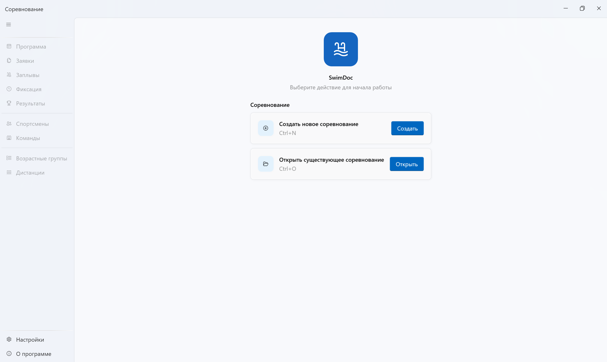
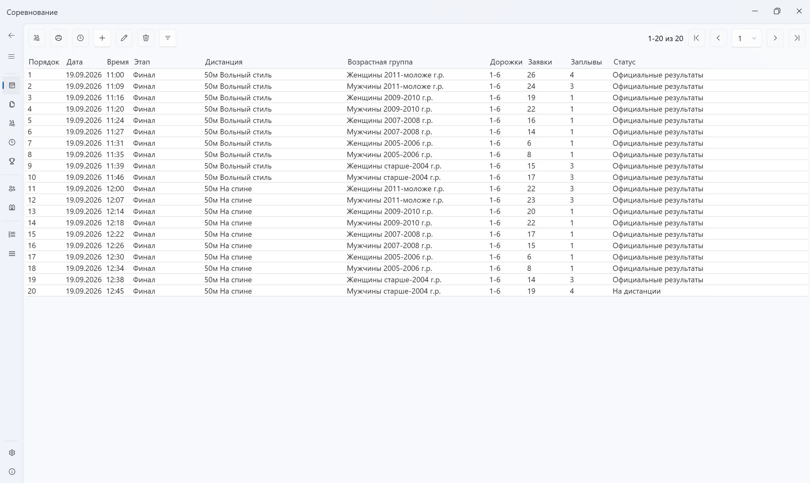
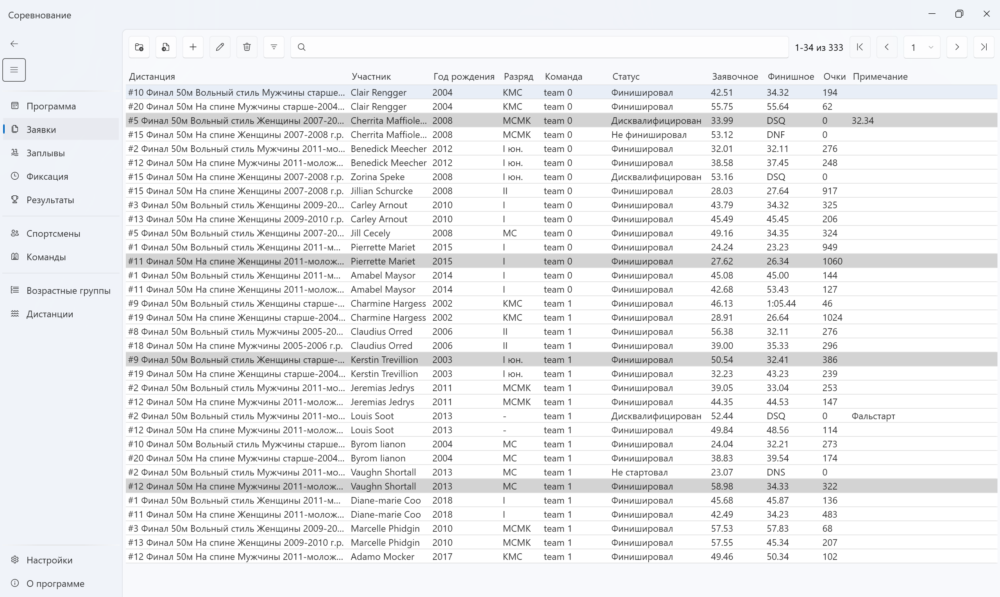
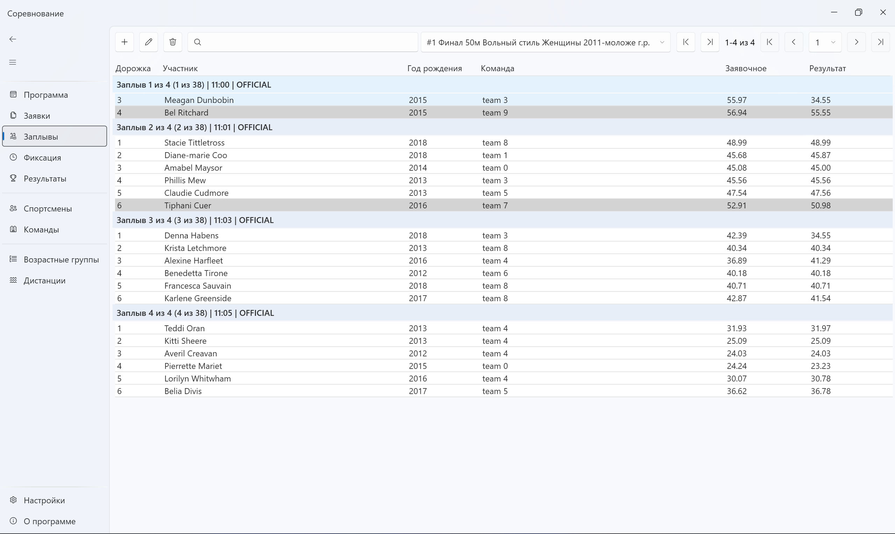
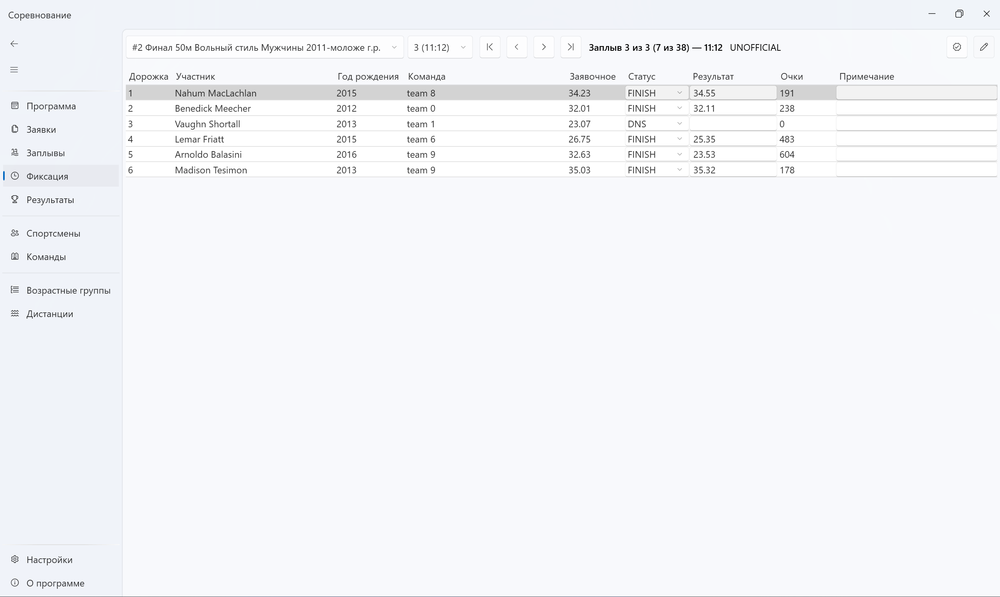
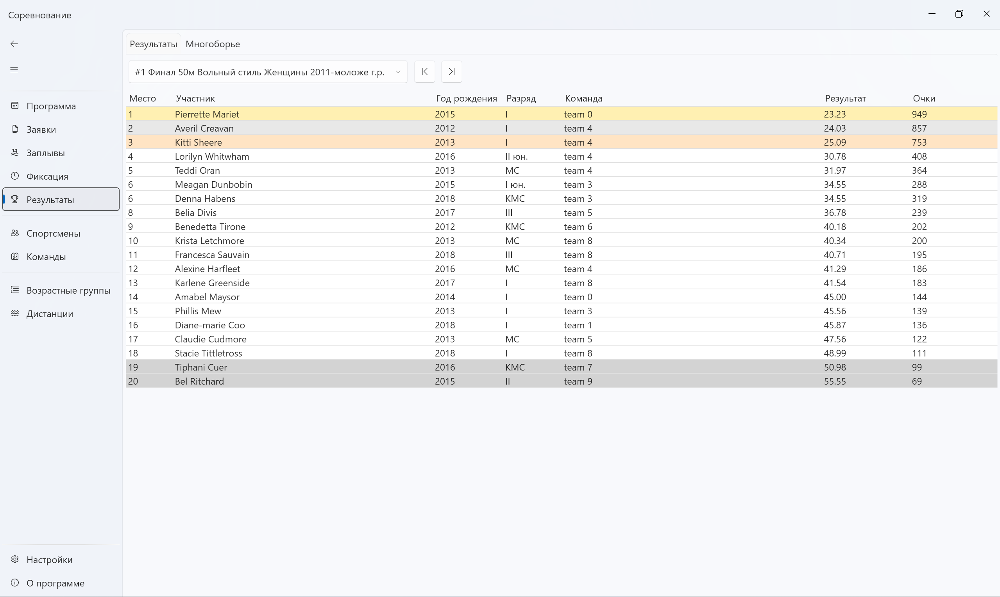

# Name

**SwimDoc**

Desktop application for managing swimming competitions — from entries to heats, results, and reports.

# Description

SwimDoc helps swimming clubs, schools, and meet organizers run competitions with less manual work. The app covers the full meet workflow in a single Windows interface.

**User guide (RU):** [GitHub Wiki](https://github.com/KJI0YH/SwimDoc/wiki)

**Features**

- Reference data: athletes, clubs, age groups, swim styles, events
- Entries import from Excel
- Heat allocation and start times
- Results and combined scoring
- Excel report export

# Visuals

<p align="center">
  
</p>
<p align="center">
  
</p>
<p align="center">
  
</p>
<p align="center">
  
</p>
<p align="center">
  
</p>
<p align="center">
  
</p>

# Installation

## Requirements

- Windows 10 or 11 (64-bit)
- No separate .NET runtime install required for release builds (self-contained)

## End users

1. Download the latest `SwimDocSetup.exe` from [Releases](https://github.com/KJI0YH/SwimDoc/releases).
2. Run the installer and follow the wizard.
3. Launch **SwimDoc** .

## Build from source

1. Install the [.NET 10 SDK](https://dotnet.microsoft.com/download).
2. Clone the repository:

   ```bash
   git clone https://github.com/KJI0YH/SwimDoc.git
   cd SwimDoc
   ```

3. Open `SwimDoc.sln` in Rider or Visual Studio and run the `UI` project, **or** publish a self-contained build:

   ```powershell
   dotnet publish UI/UI.csproj -c Release -r win-x64 --self-contained true -o Artifacts/Publish/win-x64
   ```

4. Run `Artifacts/Publish/win-x64/SwimDoc.exe`.

# Authors

- **Aliaksei Kryzhanouski** — Minsk, Belarus  
  [aliaksei.kryzhanouski@gmail.com](mailto:aliaksei.kryzhanouski@gmail.com)

# License

SwimDoc is free for **personal and noncommercial use only**, under the [Polyform Noncommercial License 1.0.0](LICENSE).

Commercial use, resale, and paid distribution require the author's permission.

Third-party libraries are subject to their own licenses. The software is provided «as is», without warranty of any kind.
