# SwimDoc — руководство пользователя

SwimDoc — десктопное приложение для организации соревнований по плаванию: от заявок и заплывов до фиксации результатов и формирования протоколов в Excel.

Каждое соревнование хранится в отдельном файле базы данных SQLite (`.db`). После открытия соревнования становится доступно боковое меню с разделами программы.

---

## Содержание

1. [Создание/открытие соревнования](#1-создание-и-открытие-соревнования)
2. [Скачивание шаблона заявочного протокола и его заполнение](#2-скачивание-и-заполнение-заявочного-протокола)
3. [Импортирование заявок](#3-импортирование-заявок)
4. [Создание события](#4-создание-события)
5. [Создание, редактирование и удаление сущностей](#5-создание-редактирование-и-удаление-сущностей)
6. [Формирование заплывов и расчёт времени старта](#6-формирование-заплывов-и-расчёт-времени-старта)
7. [Фиксация результатов](#7-фиксация-результатов)
8. [Формирование отчётов](#8-формирование-отчётов)
9. [Настройка приложения](#9-настройка-приложения)
10. [Обратная связь](#10-обратная-связь)

---

## Обзор интерфейса

### Меню в строке заголовка

| Действие | Горячая клавиша |
|----------|-----------------|
| **Соревнование → Создать** | Ctrl+N |
| **Соревнование → Открыть** | Ctrl+O |

### Боковое меню

После открытия соревнования доступны разделы:

| Раздел | Назначение                                          |
|--------|-----------------------------------------------------|
| **Программа** | События соревнования                                |
| **Заявки** | Заявки спортсменов и эстафеты                       |
| **Заплывы** | Распределение заявок по заплывам и дорожкам         |
| **Фиксация** | Ввод результатов на дорожках в течение соревнования |
| **Результаты** | Итоговые места и многоборье                         |
| **Спортсмены** | Справочник спортсменов                              |
| **Команды** | Справочник команд                                   |
| **Возрастные группы** | Справочник возрастных групп                         |
| **Дистанции** | Справочник дистанций и стилей                       |
| **Настройки** | Параметры приложения                                |
| **О программе** | Версия, обновления, обратная связь                  |

Разделы **Настройки** и **О программе** доступны всегда, даже если соревнование не открыто.

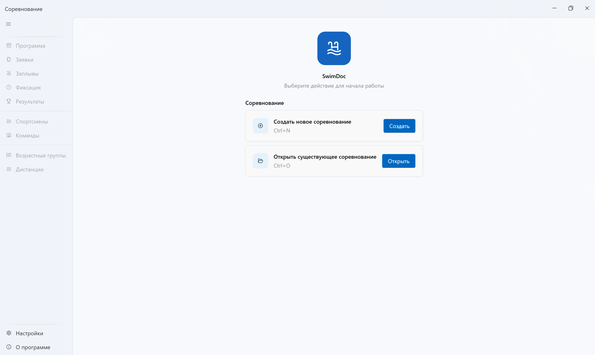

---

## 1. Создание и открытие соревнования

### Создание нового соревнования

1. Запустите SwimDoc.
2. На стартовом экране нажмите **Создать** (или используйте Ctrl+N).
3. В диалоге укажите папку и имя файла с расширением `.db`.

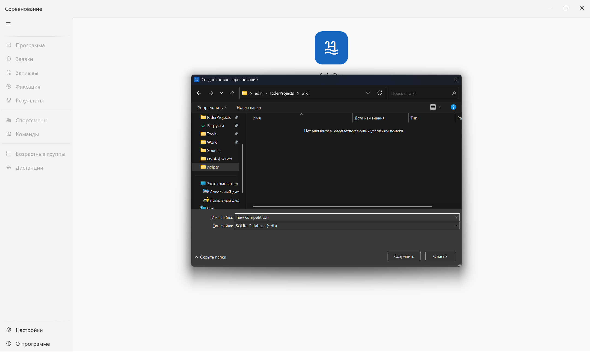

4. Нажмите **Сохранить** — приложение создаст файл базы данных.
5. Боковое меню разблокируется, откроется раздел **Программа**.

### Открытие существующего соревнования

1. На стартовом экране нажмите **Открыть** (или Ctrl+O).
2. Выберите файл соревнования (`.db`).
3. После загрузки данных откроется раздел **Программа**.

> Один файл `.db` — одно соревнование. Для нового соревнования создайте новый файл.

---

## 2. Скачивание и заполнение заявочного протокола

Заявки удобно собирать в Excel-шаблоне, который затем импортируется в программу.

### Скачивание шаблона

1. Перейдите в **Настройки** (нижний пункт бокового меню).
2. В секции **Файлы** найдите карточку **Шаблон Excel для импорта заявок**.
3. Нажмите **Скачать** и сохраните файл.

### Структура шаблона

Шаблон содержит два листа:

#### Лист «Заявки»

Основной лист для ввода заявок.

| Колонки (слева направо) | Описание                                                                          |
|-------------------------|-----------------------------------------------------------------------------------|
| Команда | Название команды                                                                  |
| Имя, Фамилия | Имя, фамилия спортсмена                                                           |
| Год рождения | Год рождения спорстмена, число                                                    |
| Пол | Выбор из списка (Мужчины / Женщины)                                               |
| Разряд | Выбор из списка (МС, КМС, I, II и т.д.)                                     |
| Далее — колонки дистанций | Заголовки в строках 2–3: дистанция и стиль|

Для каждой дистанции, на которую спортсмен заявляется, укажите заявочное время в соответствующей колонке. 
Пустая ячейка означает, что спортсмен на эту дистанцию не заявлен.
Заливка ячейки желтым цветом означает, что спортсмен заявлен на эту дистанцию вне зачёта (эта заявка очков не принесёт)

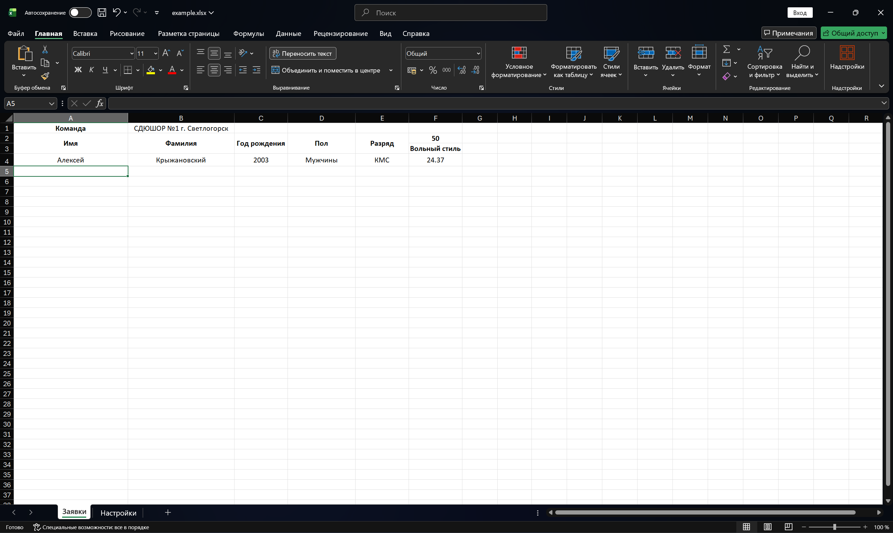

### Рекомендации по заполнению

- Не переименовывайте листы «Заявки» и «Настройки».
- Используйте значения из выпадающих списков — это снижает риск ошибок при импорте.

---

## 3. Импортирование заявок

### Импорт из Excel-файла

1. Откройте соревнование и перейдите в **Заявки**.
2. Нажмите **Загрузить заявки из файла**.
3. В диалоге выберите один или несколько файлов `.xlsx` / `.xls`.
4. Дождитесь завершения импорта.

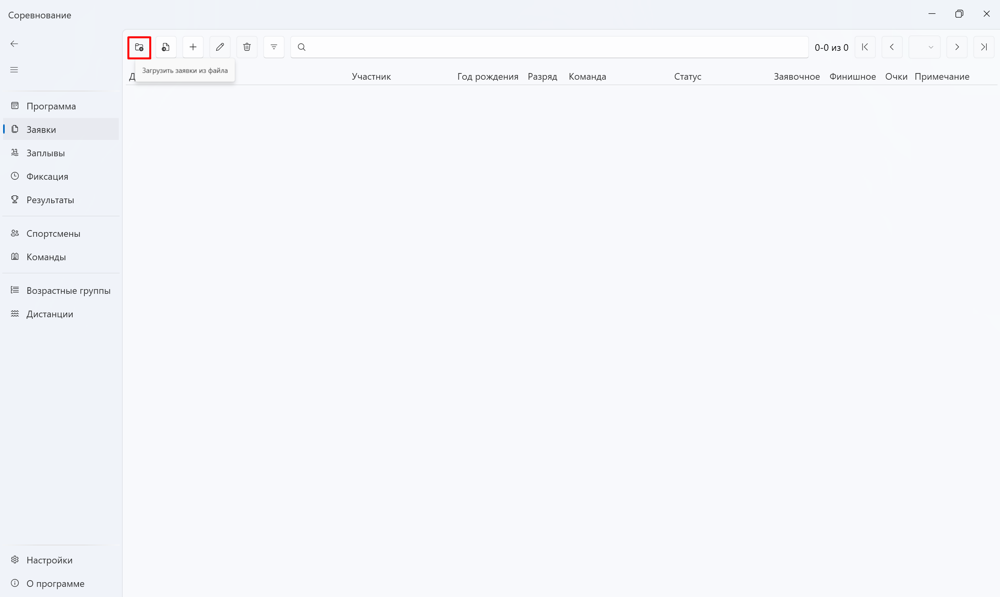

В нижней части экрана появится панель прогресса с результатами по каждому файлу:

| Колонка | Значение |
|---------|----------|
| Файл | Имя обработанного файла |
| Команды | Созданные или обновлённые команды |
| Спортсмены | Созданные или обновлённые спортсмены |
| Заявки | Импортированные заявки |
| Предупреждения | Некритичные замечания |
| Ошибки | Строки, которые не удалось обработать |

Во время импорта доступны кнопки **Подробнее** и **Прервать**. После завершения — **Закрыть**. Таблица заявок обновляется автоматически.

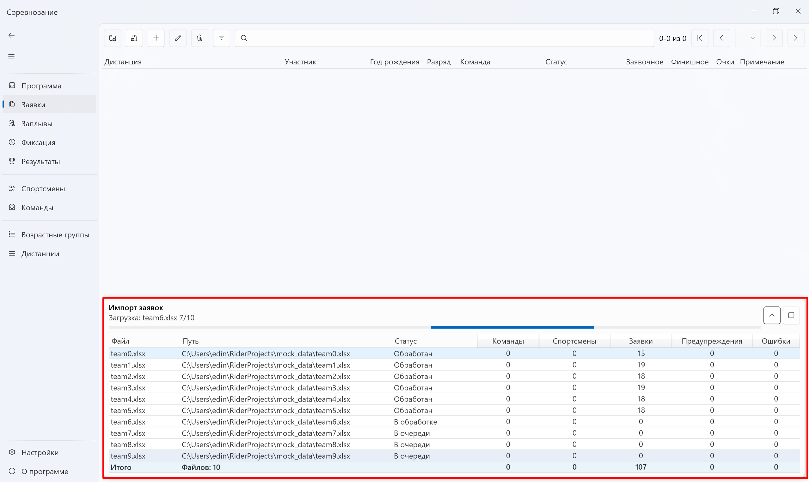

### Импорт из предыдущего события

Итоговые результаты можно автоматически импортировать из предыдущего этапа (например, из предварительных в полуфиналы, из полуфиналов в финалы и т.д.):

1. Нажмите **Загрузить заявки из предыдущего события**.
2. В диалоге выберите **предыдущее событие** и **следующее событие** и нажмите **сохранить**.

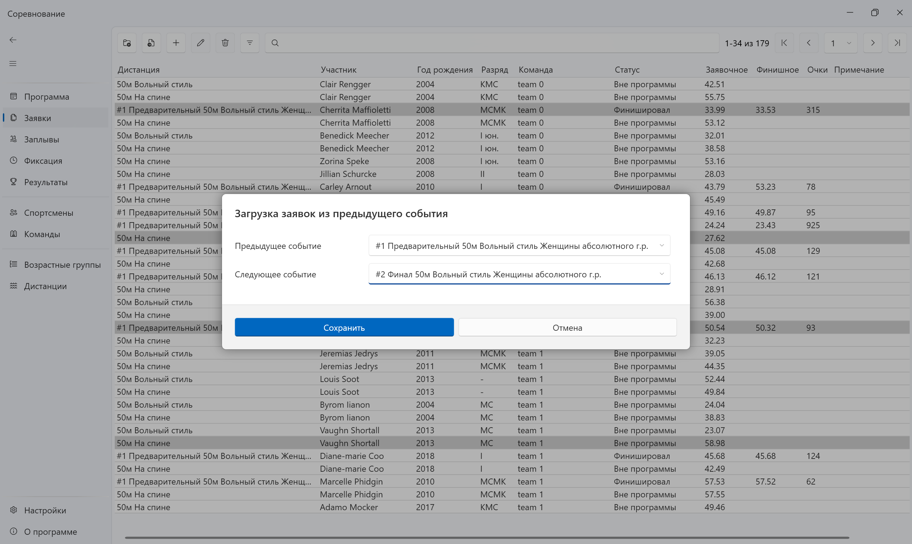

### Что происходит при импорте

- Команды и спортсмены создаются автоматически, если их ещё нет в базе.
- Заявки привязываются к событиям по дистанции, стилю, полу и возрастной группе.
- Если заявку невозможно определить ни в одно событие, то заявка будет в статусе **"Вне программы"**

---

## 4. Создание события

Событие — это конкретная дистанция в программе соревнования (дистанция, возрастная группа, этап, дорожки, количество участников).

### Создание

1. Перейдите в **Программа**.
2. Нажмите **+** (создать) на панели инструментов.
3. В диалоге **Создание события** заполните поля:

| Поле                  | Описание                                         |
|-----------------------|--------------------------------------------------|
| Порядок               | Номер в программе соревнования                   |
| Дата, Время           | Дата и время проведения                          |
| Дистанция / Стиль     | Из справочника дистанций                         |
| Возрастная группа     | Из справочника возрастных групп                  |
| Длина бассейна        | Длина бассейна (25 м / 50 м) для расчёта очков   |
| Этап            | Предварительный, полуфинал, финал и т.д.         |
| Предыдущее событие    | Связь с событием предыдущего этапа               |
| Число участников этапа | Сколько спортсменов может учавствовать в событии |
| Дорожки               | Диапазон дорожек |

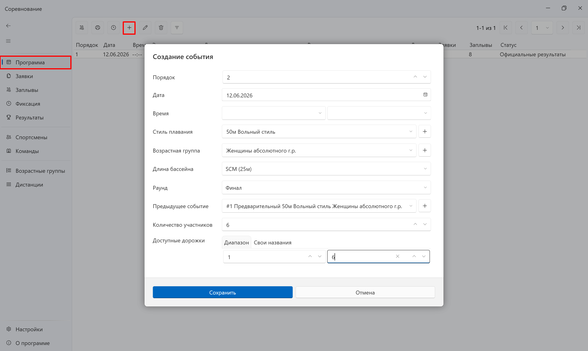

4. Нажмите **Сохранить**.

Событие появится в таблице с колонками: порядок, дата, время, этап, дистанция, возрастная группа, дорожки, число заявок, число заплывов, статус.

### Дополнительные действия

- **Двойной щелчок** по строке — открыть детальную страницу события.
- **Карандаш** — редактировать выбранное событие.
- **Корзина** — удалить выбранное событие.

---

## 5. Создание, редактирование и удаление сущностей

Во всех разделах со списками (заявки, спортсмены, команды, события и др.) используется единый подход.

### Общие действия

| Действие | Кнопка                 | 
|----------|------------------------|
| Создать | Плюс                   | 
| Редактировать | Карандаш  | 
| Удалить | Корзина                | 
| Открыть детали | Двойной щелчок         | 

На панели инструментов также доступны **поиск**, **фильтры** и **пагинация** (листание страниц).

### Пример: работа с заявкой

Раздел **Заявки**.

#### Создание заявки вручную

1. Нажмите **Плюс**.
2. В диалоге выберите вкладку:
   - **Личная заявка** — личная заявка спортсмена
   - **Эстафета** — командная заявка эстафеты
3. Укажите спортсмена (или команду эстафеты), событие, заявочное время, в зачёт/вне зачёта
4. Кнопки **Плюс** рядом с полями позволяют быстро создать нового спортсмена или событие, не закрывая диалог.
5. Нажмите **Сохранить**.

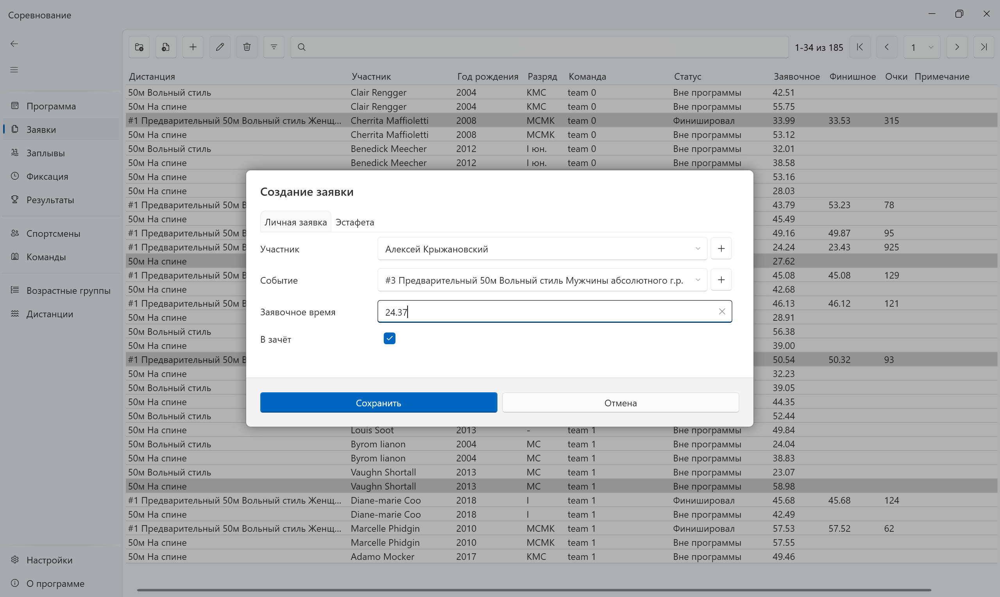

#### Редактирование

1. Выделите одну заявку в таблице.
2. Нажмите карандаш
3. Измените нужные поля и сохраните.

#### Удаление

1. Выделите одну или несколько заявок.
2. Нажмите корзину или Delete.
3. Подтвердите удаление.

> Если с сущностью связаны официальные результаты, программа предупредит об этом и запросит дополнительное подтверждение.

### Аналогичные операции в других разделах

| Раздел | Что можно создавать/редактировать |
|--------|-----------------------------------|
| Спортсмены | Карточки спортсменов |
| Команды | Команды и клубы |
| Возрастные группы | Возрастные категории |
| Дистанции | Дистанции и стили |
| Заплывы | Заплывы и позиции на дорожках |

---

## 6. Формирование заплывов и расчёт времени старта

### Автоматическое распределение заплывов

1. Перейдите в **Программа**.
2. Выделите одно или несколько событий в таблице.
3. Нажмите **Сгенерировать заплывы**.
4. В диалоге укажите:
   - **Порядок сортировки** — от слабых к сильным или от сильных к слабым (по заявочному времени)
   - **Минимальный размер заплыва** — минимальное число участников в заплыве (например, для ситуаций, когда дорожек 6, а заявок 7. При минимальном числе участников, равном 2, создастся два заплыва; на 2 и 5 участников; равном 3 - на 3 и 4 и т.д.)

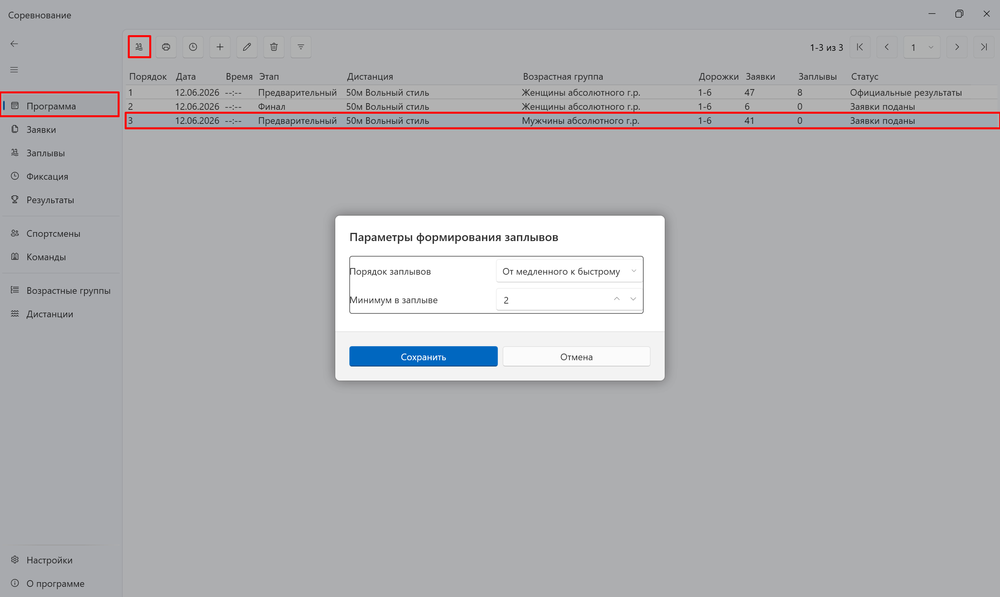

5. Подтвердите операцию.

Если у события уже есть заплывы или официальные результаты, программа запросит подтверждение переформирования.

Прогресс отображается в нижней панели.

### Просмотр и ручное редактирование заплывов

1. Перейдите в **Заплывы**.
2. Выберите событие в выпадающем списке.
3. Таблица покажет участников, сгруппированных по заплывам и дорожкам.

### Расчёт времени старта

1. В разделе **Программа** выделите события.
2. Нажмите **Подсчитать время старта**.
3. В диалоге укажите:
   - **Время начала** (часы и минуты первого заплыва)
   - **Пауза между заплывами** (минуты)
   - **Пауза между событиями** (минуты)

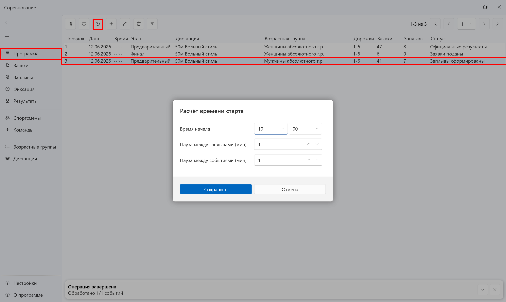

4. Подтвердите — время старта каждого заплыва будет рассчитано автоматически.

---

## 7. Фиксация результатов

Раздел **Фиксация** предназначен для ввода результатов непосредственно во время соревнования.

### Где найти

**Фиксация** → выбор события и заплыва.

### Пошагово

1. Перейдите в **Фиксация**.
2. Выберите **событие** и **заплыв** в выпадающих списках (или переключайтесь стрелками на панели).
3. Для каждой дорожки укажите:
   - **Статус** — финишировал (FINISH), не стартовал (DNS), не финишировал (DNF), дисквалификация (DSQ)
   - **Результат** — время (для финишировавших)
   - **Примечание** — при необходимости
4. **Очки** рассчитываются автоматически на основе базового времени World Aquatics.
5. Когда все дорожки заполнены корректно, нажмите **Утвердить заплыв**.

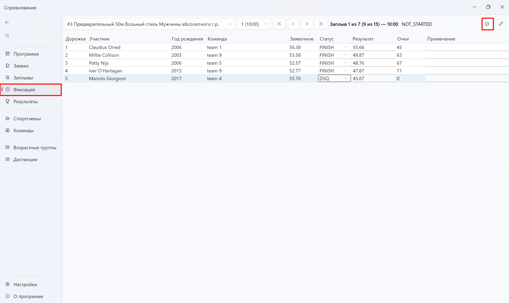

### Утверждение и правки

| Действие | Когда использовать                                                                        |
|----------|-------------------------------------------------------------------------------------------|
| **Утвердить заплыв** | Все дорожки заполнены — фиксирует результаты в базе, статус заплыва становится «OFFICIAL» |
| **Снять утверждение** | Нужно исправить уже утверждённый заплыв, статус заплыва становится «UNOFFICIAL»           |

> До утверждения правки хранятся в памяти. Сохранение в базу происходит при нажатии **Утвердить заплыв**.

### Дополнительно

- После утверждения всех заплывов события итоговые места доступны в разделе **Результаты**.

---

## 8. Формирование отчётов

### Протоколы по событиям

1. Перейдите в **Программа**.
2. Выделите одно или несколько событий.
3. Нажмите **Сгенерировать отчёт**.
4. В диалоге **Генерация отчётов** отметьте нужные типы:

| Тип | Содержание |
|-----|------------|
| **Заявочный протокол** | Список заявившихся спортсменов |
| **Стартовый протокол** | Заплывы, дорожки, время старта |
| **Итоговый протокол** | Места и результаты |

5. Укажите путь к файлу `.xlsx` и нажмите **Сохранить**.

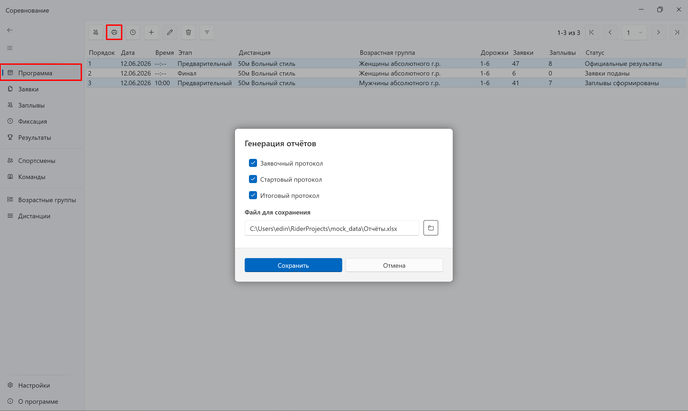

Прогресс формирования отображается в нижней панели.

### Отчёт по многоборью

1. Перейдите в **Возрастные группы**.
2. Выделите одну или несколько возрастных групп.
3. Нажмите **Сгенерировать отчёт по многоборью**.
4. Укажите путь сохранения.

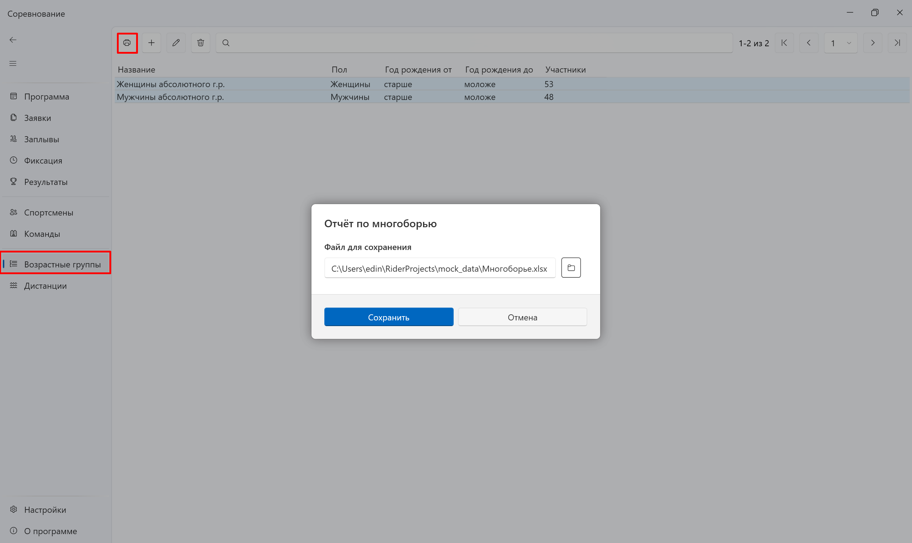

---

## 9. Настройка приложения

Раздел **Настройки** доступен из нижней части бокового меню в любой момент.

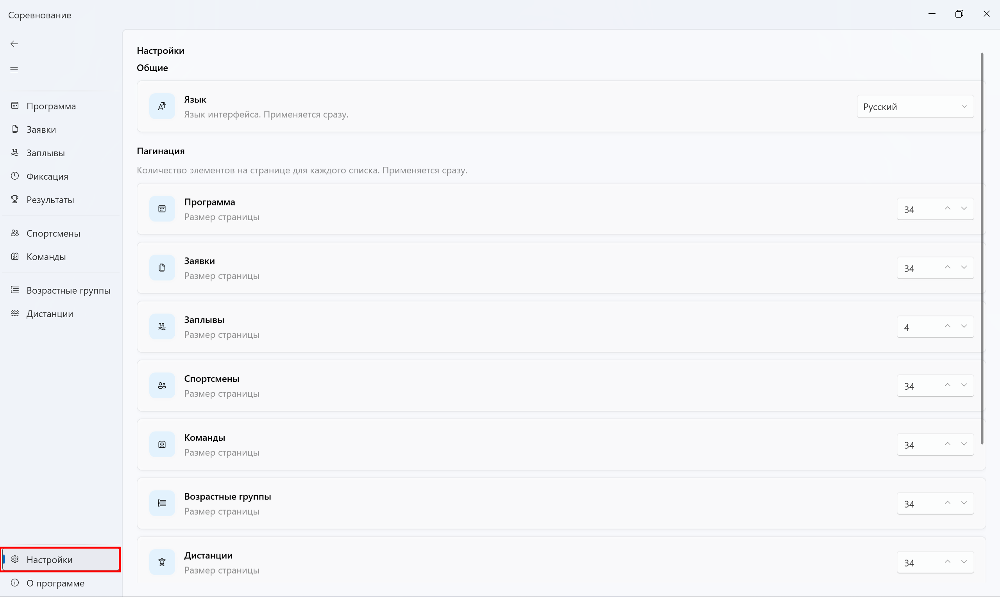

### Общие

- **Язык интерфейса** — русский или английский. Изменение применяется сразу.

### Пагинация

Размер страницы (число строк на экране) для каждого списка: Программа, Заявки, Заплывы, Спортсмены и др.

### Файлы

- **Шаблон Excel для импорта заявок** — скачать шаблон заявочного протокола (см. [раздел 2](#2-скачивание-и-заполнение-заявочного-протокола)).

### Соревнование

- **Базовое время** — эталонные времена World Aquatics для расчёта очков. Можно просмотреть актуальные значения с сайта WA.

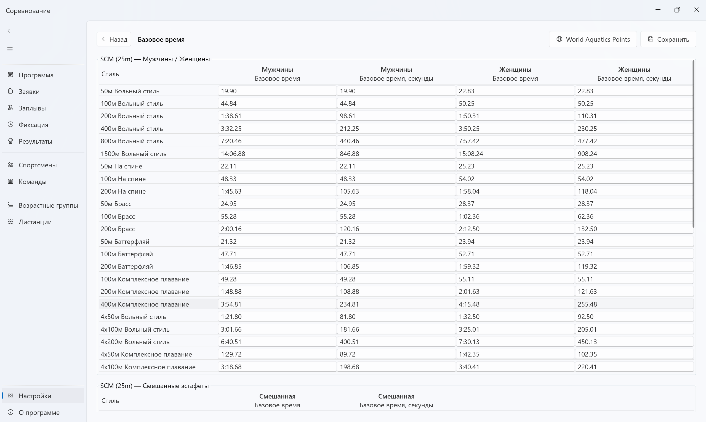

---

## 10. Обратная связь

Раздел **О программе** (нижний пункт бокового меню).

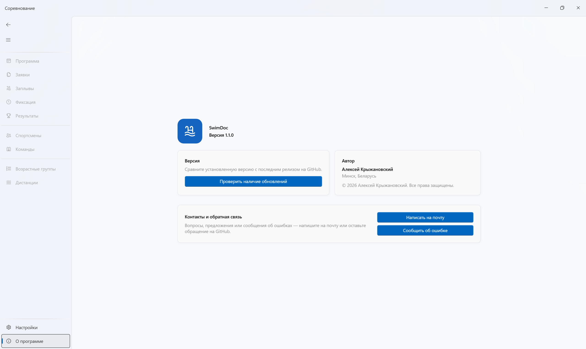

### Что доступно

| Кнопка | Действие                                                                       |
|--------|--------------------------------------------------------------------------------|
| **Проверить наличие обновлений** | Сравнение с последним релизом на GitHub; при наличии новой версии — скачивание |
| **Написать на почту** | Открывает почтовый клиент для связи с автором                                  |
| **Сообщить об ошибке** | Переход на страницу создания issue на GitHub                                   |

На странице также отображаются версия приложения, информация об авторе.

---

## Установка и обновление

- Скачать установщик: [Releases на GitHub](https://github.com/KJI0YH/SwimDoc/releases)

Подробнее — в [README](../README.md).
